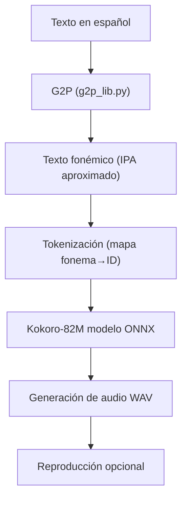

# 🗣️ Kokoro TTS Español – Prueba de concepto

**Kokoro TTS Español** es una demostración de síntesis de voz (*Text-to-Speech*) en español que combina el modelo **Kokoro-82M v1.0 (ONNX)** con una biblioteca personalizada de conversión **grafema-a-fonema (G2P)**, basada en un sistema fonético del español cercano al **IPA (Alfabeto Fonético Internacional)**. 

Convierte texto en español en una secuencia fonémica y luego genera un archivo de audio `.wav` con voz natural.

---

## 🚀 Instalación

1. **Clonar el repositorio**
   ```
   git clone https://github.com/Topping1/Kokoro-TTS-spanish
   cd Kokoro-TTS-spanish
   ```

2. **Descargar los modelos desde la sección de *Releases*:**

   * [model.onnx](https://github.com/Topping1/Kokoro-TTS-spanish/releases/download/alpha_v1/model.onnx)
   * [ef_dora.bin](https://github.com/Topping1/Kokoro-TTS-spanish/releases/download/alpha_v1/ef_dora.bin)
   * [em_alex.bin](https://github.com/Topping1/Kokoro-TTS-spanish/releases/download/alpha_v1/em_alex.bin)
   * [em_santa.bin](https://github.com/Topping1/Kokoro-TTS-spanish/releases/download/alpha_v1/em_santa.bin)

   📁 Coloca los archivos `.bin` dentro de la carpeta `voices/` y el modelo `model.onnx` dentro de la carpeta `onnx/`.

3. **Instalar dependencias**

   ```
   pip install numpy onnxruntime sounddevice soundfile scipy
   ```

   > 💡 Si solo quieres generar el audio sin reproducirlo automáticamente, las librerías `sounddevice`, `soundfile` y `scipy` son opcionales.

---

## ⚙️ Uso

Ejecuta el programa desde la terminal:

```
python tts-kokoro-esp.py
```

Ejemplo de sesión interactiva:

```
Loading resources, please wait...
Resources loaded. Ready for input.

> Hola, ¿cómo estás?
IPA: / ˈola , ˈkomo esˈtas /
Audio saved to output.wav
Playing audio...
Playback finished.
```

El resultado se guarda como **`output.wav`** en el directorio actual.

---

## 🧩 Diagrama de flujo



---

## 🎙️ Cambio de voz

Para cambiar la voz utilizada, abre el archivo **`tts-kokoro-esp.py`** y busca esta línea dentro de la función `main()`:

```python
voice_file = './voices/em_santa.bin'
```

Puedes cambiarla por cualquiera de las otras voces disponibles:

```python
voice_file = './voices/em_alex.bin'
# o
voice_file = './voices/ef_dora.bin'
```

---

## 📚 Créditos y atribuciones

* **Conversión grafema-a-fonema (G2P):**
  Basado en *“Automatic Transcription of Phonemic and Phonetic Spanish”*
  por **David Kenneth Crandall (© 2025)**
  🔗 [http://crandall.altervista.org/sp/phonetic-spanish-espanol-fonetico.html](http://crandall.altervista.org/sp/phonetic-spanish-espanol-fonetico.html)

* **Modelos TTS (Kokoro-82M v1.0 – ONNX):**
  Hugging Face: [onnx-community/Kokoro-82M-v1.0-ONNX](https://huggingface.co/onnx-community/Kokoro-82M-v1.0-ONNX)

---

## ⚠️ Limitaciones conocidas

* ❌ No reconoce correctamente **números** (por ejemplo, “2025” no se pronuncia).
* ⚠️ Existe un **límite de longitud** (~510 tokens), impuesto por el modelo ONNX.
* ⚠️ **Siglas y abreviaturas** no se expanden correctamente.
* ⚠️ Algunos caracteres fuera del mapa fonético pueden ser ignorados.

---

## 🧭 TODO

* [ ] Implementar conversión de números a texto (“123” → “ciento veintitrés”).
* [ ] Mejorar el tratamiento de abreviaturas y acrónimos.
* [ ] Dividir automáticamente textos largos en frases más cortas.
* [ ] Añadir controles de velocidad y tono en tiempo real.

---

## 🧪 Estado del proyecto

> 💡 Este repositorio es **solo una prueba de concepto**
> No representa una implementación final ni oficial del modelo Kokoro.

---

## 📄 Licencia

Este proyecto se distribuye bajo la licencia **MIT**.
Consulta el archivo `LICENSE` para más información.
